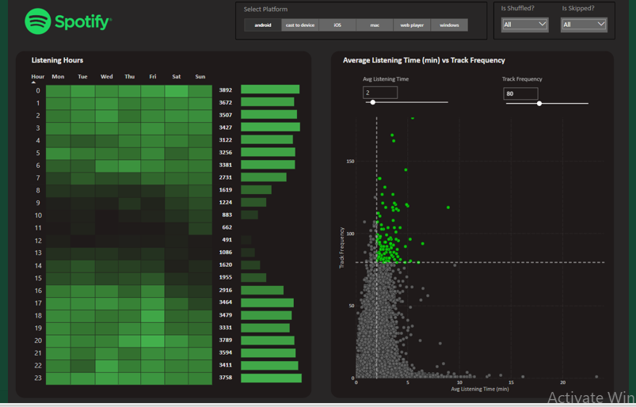

# 🎧 Spotify Data Analysis - Power BI Project

## 📌 Objective
In the age of digital music, understanding user behavior and engagement on Spotify is vital for artists, businesses, and the platform itself. This project analyzes **Spotify album, artist, and track data** to extract deep insights into listening patterns over time.

## 📸 Dashboards

<p align="center">
  
  &nbsp;
  
</p>

---

## 📂 Data Fields Explained

| Column Name       | Description                                                                 |
|-------------------|-----------------------------------------------------------------------------|
| `spotify_track_uri` | Unique identifier for each track (e.g., `spotify:track:abc123`)             |
| `ts`               | Timestamp when the track stopped playing (ISO format)                      |
| `platform`         | Device used to play the track (desktop, mobile, web, smart speaker)        |
| `ms_played`        | Duration the track was played (in milliseconds)                            |
| `track name`       | Name of the track played                                                    |
| `artist name`      | Artist of the track                                                         |
| `album name`       | Album name of the track                                                     |
| `reason start`     | Why the track started playing (e.g., autoplay, play button, next button)   |
| `reason end`       | Why the track ended (e.g., skip, track finished, logout)                   |
| `shuffle`          | Was shuffle enabled? (TRUE/FALSE)                                          |
| `skipped`          | Was the track skipped before completion? (TRUE/FALSE)                      |

---

## 🔧 Project Steps

1. **Requirement Gathering**
2. **Data Walkthrough**
3. **Data Connection**
4. **Data Cleaning / Quality Check**
5. **Data Modeling**
6. **Data Processing**
7. **DAX Calculations**
8. **Dashboard Layout Design**
9. **Chart Creation and Formatting**
10. **Insight Generation**

---

## 📊 Business Requirements & Dashboards

### 🎵 Album-Level Insights
- **Total Albums Played Over Time**
- **Albums by Year** – Min/Max analysis
- **Weekend vs Weekday Listening Patterns**
- **Top 5 Albums**
- **YoY Album Consumption Trends**

### 👤 Artist-Level Insights
- **Total Artists Played Over Time**
- **Artists by Year** – Min/Max
- **Weekend vs Weekday Engagement**
- **Top 5 Artists**
- **YoY Artist Engagement Trends**

### 🎶 Track-Level Insights
- **Tracks Played Over Time**
- **Track Count by Year**
- **Top 5 Tracks**
- **Weekend vs Weekday Behavior**
- **YoY Track Growth**

### ⏱️ Listening Patterns
- **Heatmap of Listening Hours** – Peak times analysis
- **Avg Listening Time vs Frequency (Scatter Plot)**
  - High Frequency + High Time → Super Hits
  - Low Frequency + High Time → Niche Listens
  - High Frequency + Low Time → Skippable Hits
  - Low Frequency + Low Time → Least Popular

### 📋 Grid View Report
- Interactive drill-through with **Album**, **Artist**, and **Track Name**
- Supports **drill up/down**, hierarchy navigation
- **CSV Export** enabled for selected rows

---

## 📈 Key DAX Measures Used

### ✅ 1. Default Rate by Employment Type (%)
```dax
Default Rate by Employment type (%) = 
DIVIDE(
    CALCULATE(COUNTROWS('Loan_default'), 'Loan_default'[Default] = 1, ALLEXCEPT('Loan_default', 'Loan_default'[EmploymentType])),
    CALCULATE(COUNTROWS('Loan_default'), ALLEXCEPT('Loan_default', 'Loan_default'[EmploymentType])),
    0
) * 100
```

### ✅ 2. YoY Loan Amount Change (%)
```dax
YoY Loan Amount Change (%) = 
DIVIDE(
    CALCULATE(SUM('Loan_default'[LoanAmount]), 'Loan_default'[Year] = MAX('Loan_default'[Year]))
    - CALCULATE(SUM('Loan_default'[LoanAmount]), 'Loan_default'[Year] = MAX('Loan_default'[Year]) - 1),
    CALCULATE(SUM('Loan_default'[LoanAmount]), 'Loan_default'[Year] = MAX('Loan_default'[Year]) - 1),
    0
) * 100
```

### ✅ 3. YoY Default Loan Count Change (%)
```dax
YOY Default Loans Change (%) =
DIVIDE(
    CALCULATE(COUNTROWS('Loan_default'), 'Loan_default'[Default] = 1, 'Loan_default'[Year] = MAX('Loan_default'[Year]))
    - CALCULATE(COUNTROWS('Loan_default'), 'Loan_default'[Default] = 1, 'Loan_default'[Year] = MAX('Loan_default'[Year]) - 1),
    CALCULATE(COUNTROWS('Loan_default'), 'Loan_default'[Default] = 1, 'Loan_default'[Year] = MAX('Loan_default'[Year]) - 1),
    0
) * 100
```

### ✅ 4. YTD Loan Amount
```dax
YTD Loan Amount = 
CALCULATE(
    SUM('Loan_default'[LoanAmount]),
    DATESYTD('Loan_default'[Loan Date (DD/MM/YYYY)]),
    ALLEXCEPT('Loan_default', 'Loan_default'[Credit Score bins], 'Loan_default'[MaritalStatus])
)
```

### ✅ 5. Age Group Categorization
```dax
Age Group = 
SWITCH(
    TRUE(),
    'Loan_default'[Age] >= 13 && 'Loan_default'[Age] <= 19, "Teen",
    'Loan_default'[Age] >= 20 && 'Loan_default'[Age] <= 39, "Adult",
    'Loan_default'[Age] >= 40 && 'Loan_default'[Age] <= 59, "Middle Adult",
    'Loan_default'[Age] >= 60, "Senior Citizen",
    "Unknown"
)
```

---

## 🛠️ Tools Used

- **Power BI** (Data Modeling, DAX, Visualizations, Reports)
- **Excel** (Pre-cleaning and exploration)
- **Figma / Pen-paper Sketching** (Dashboard planning)
- **PowerPoint** (Presentation of insights)

---

## 🚀 Outcome

- Clear trends in music consumption by artist, album, and track
- Identified high-performing music across different time windows
- Created an interactive, executive-level report with drill-down and export capabilities

---

## 📎 Files Included

- 📊 **Spotify Analysis.pptx** – Final dashboard insights
- 📄 **Spotify Data Explanation.docx** – Field-level metadata & documentation


---

## 📚 Spotify Data Dictionary (Domain Document)

### 🎵 Track Metadata Fields

#### • `spotify_track_uri`
- **Description:** A unique identifier assigned to each track in Spotify’s database.
- **Format:** `"spotify:track:<base-62 string>"` (e.g., `spotify:track:3n3Ppam7vgaVa1iaRUc9Lp`)
- **Purpose:** Helps link tracks to their metadata and allows for cross-referencing with Spotify’s catalog.

#### • `ts` (Timestamp)
- **Description:** The exact time (in UTC) when the track stopped playing.
- **Format:** ISO 8601 format (e.g., `2024-02-07T14:30:45Z`)
- **Purpose:** Used for analyzing listening patterns, session durations, and track end times.

#### • `platform`
- **Description:** The device or platform used to stream the track.
- **Possible Values:**
  - `"desktop"` (Windows/Mac app)
  - `"mobile"` (iOS/Android app)
  - `"web"` (Spotify Web Player)
  - `"smart speaker"` (Amazon Echo, Google Home, etc.)
- **Purpose:** Helps understand where users are consuming music.

#### • `ms_played`
- **Description:** The total number of milliseconds the track was played before stopping or skipping.
- **Format:** Integer (e.g., `215000` for 3 minutes 35 seconds)
- **Purpose:** Useful for engagement analysis, identifying completed plays, and calculating revenue.

#### • `track name`
- **Description:** The title of the song being played.
- **Example:** `"Shape of You"`
- **Purpose:** Helps in analyzing the most played tracks.

#### • `artist name`
- **Description:** The name of the artist performing the song.
- **Example:** `"Ed Sheeran"`
- **Purpose:** Useful for ranking popular artists and identifying user preferences.

#### • `album name`
- **Description:** The name of the album the track belongs to.
- **Example:** `"÷ (Divide)"`
- **Purpose:** Helps analyze album popularity and user listening trends.

#### • `reason start`
- **Description:** The reason why the track started playing.
- **Possible Values:**
  - `"trackdone"` (Previous track ended)
  - `"clickrow"` (User manually selected the song)
  - `"backbtn"` (User pressed back)
  - `"fwdbtn"` (User pressed next)
  - `"playbtn"` (User pressed play)
  - `"autoplay"` (Spotify automatically selected the next track)
- **Purpose:** Helps understand user behavior and track engagement patterns.

#### • `reason end`
- **Description:** The reason why the track stopped playing.
- **Possible Values:**
  - `"trackdone"` (Track finished playing)
  - `"endplay"` (User paused or stopped playback)
  - `"fwdbtn"` (User skipped to the next track)
  - `"backbtn"` (User went back to the previous track)
  - `"logout"` (User logged out or session ended)
- **Purpose:** Helps identify why users stop listening to tracks, which is crucial for retention analysis.

#### • `shuffle`
- **Description:** Indicates whether shuffle mode was enabled during playback.
- **Possible Values:**
  - `TRUE` (Shuffle mode ON)
  - `FALSE` (Shuffle mode OFF)
- **Purpose:** Helps analyze how often users use shuffle mode in their listening sessions.

#### • `skipped`
- **Description:** Indicates whether the user skipped the song before it finished.
- **Possible Values:**
  - `TRUE` (User skipped to the next track)
  - `FALSE` (User did not skip)
- **Purpose:** Important for understanding user engagement, drop-off rates, and song popularity.

